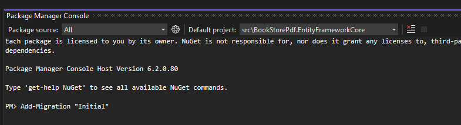

# Generate PDF's in an ABP Framework Project using scryber.core

In this article, we'll create a basic application with blazor-server for UI to demonstrate how generating PDF's can be implemented in an ABP project.
To archieve this, we will use [scryber.core](https://github.com/richard-scryber/scryber.core).

For the sake of simplicity I will reduce everything to the bare minimum just so that you get a picture of how everything works together.
PDF's will be generated server side. This post will show how to download the generated PDF file. If you are using a different UI layer, you just need to implement your download a bit different.

## Creating the Solution

For this article, we will create a simple application with blazor-server for our UI.
Feel free to use something different. I'll showcase a download of the pdf file

We can create a new startup template with EF Core as a database provider and MVC for the UI Framework.

> If you already have a project, you don't need to create a new startup template, you can directly implement the following steps to your project. So you can skip this section.
We can create a new startup template by using the [ABP CLI](https://docs.abp.io/en/abp/latest/CLI).

```bash
abp new BookStorePdf -t app -u blazor-server -d ef
```

After running the above command, our project boilerplate will be downloaded. Then we can open the solution and start the development.

## Starting the Development

First of all we add the initial migration. There are multiple ways doing that. I like to do it like this:
1. Set `BookStorePdf.EntityFrameworkCore` as startup project
2. Open Package Manager Console and ensure Default Project is the same
   
3. Execute `Add-Migration "Initial"` 
4. Execute `BookStorePdf.DbMigrator`

We can now start up `BookStorePdf.Blazor` and ensure that everything works correctly.


## Add Scryber.core

We are now ready to install scryber.core.

Add the `Scryber.Core` NuGet-Package to `BookStorePdf.Application`.

`BookStorePdf.Application.csproj` now looks like this:

```xml
<Project Sdk="Microsoft.NET.Sdk">

  <Import Project="..\..\common.props" />

  <PropertyGroup>
    <TargetFramework>net6.0</TargetFramework>
    <RootNamespace>BookStorePdf</RootNamespace>
  </PropertyGroup>

  <ItemGroup>
    <ProjectReference Include="..\BookStorePdf.Domain\BookStorePdf.Domain.csproj" />
    <ProjectReference Include="..\BookStorePdf.Application.Contracts\BookStorePdf.Application.Contracts.csproj" />
  </ItemGroup>

  <ItemGroup>
    <PackageReference Include="Scryber.Core" Version="5.0.7" />
    <PackageReference Include="Volo.Abp.Account.Application" Version="5.2.0" />
    <PackageReference Include="Volo.Abp.Identity.Application" Version="5.2.0" />
    <PackageReference Include="Volo.Abp.PermissionManagement.Application" Version="5.2.0" />
    <PackageReference Include="Volo.Abp.TenantManagement.Application" Version="5.2.0" />
    <PackageReference Include="Volo.Abp.FeatureManagement.Application" Version="5.2.0" />
    <PackageReference Include="Volo.Abp.SettingManagement.Application" Version="5.2.0" />
  </ItemGroup>

</Project>
```

## Managing PDF templates
To generate PDF's with scryber, we need to have templates.
For this tutorial we will use html files which we ship along with the application.
You can however write a complete ecosystem around this to be able to have the templates changeable by your users.

Let's implement everything we need to store and serve our html file.

Create `IResourceAppService.cs` in the `BookStorePdf.Application.Contracts` project with the following content:

```csharp
using Microsoft.Extensions.FileProviders;
using Volo.Abp.Application.Services;
using Volo.Abp.DependencyInjection;

namespace BookStorePdf;

public interface IResourceAppService : IApplicationService, ITransientDependency
{
    IFileInfo GetFileInfo(string path);
}
```

After that you create `ResourceAppService` in the `BookStorePdf.Application` project with this content:

```csharp
using Microsoft.Extensions.FileProviders;
using Volo.Abp.VirtualFileSystem;

namespace BookStorePdf;

public class ResourceAppService : BookStorePdfAppService, IResourceAppService
{
    private readonly IVirtualFileProvider _virtualFileProvider;

    public ResourceAppService(IVirtualFileProvider virtualFileProvider)
    {
        _virtualFileProvider = virtualFileProvider;
    }

    public IFileInfo GetFileInfo(string path)
    {
        return _virtualFileProvider.GetFileInfo(path);
    }
}

```

Change `BookStorePdfApplicationModule.cs` like this:

```csharp
using Volo.Abp.Account;
using Volo.Abp.AutoMapper;
using Volo.Abp.FeatureManagement;
using Volo.Abp.Identity;
using Volo.Abp.Modularity;
using Volo.Abp.PermissionManagement;
using Volo.Abp.SettingManagement;
using Volo.Abp.TenantManagement;
using Volo.Abp.VirtualFileSystem;

namespace BookStorePdf;

[DependsOn(
    typeof(BookStorePdfDomainModule),
    typeof(AbpAccountApplicationModule),
    typeof(BookStorePdfApplicationContractsModule),
    typeof(AbpIdentityApplicationModule),
    typeof(AbpPermissionManagementApplicationModule),
    typeof(AbpTenantManagementApplicationModule),
    typeof(AbpFeatureManagementApplicationModule),
    typeof(AbpSettingManagementApplicationModule)
    )]
public class BookStorePdfApplicationModule : AbpModule
{
    public override void ConfigureServices(ServiceConfigurationContext context)
    {
        Configure<AbpAutoMapperOptions>(options =>
        {
            options.AddMaps<BookStorePdfApplicationModule>();
        });

        // add this here
        Configure<AbpVirtualFileSystemOptions>(options =>
        {
            options.FileSets.AddEmbedded<BookStorePdfApplicationModule>();
        });
    }
}

```

Change `BookStorePdf.Application.csproj`:

```xml
<Project Sdk="Microsoft.NET.Sdk">

  <Import Project="..\..\common.props" />

  <PropertyGroup>
      <TargetFramework>net6.0</TargetFramework>
      <RootNamespace>BookStorePdf</RootNamespace>
      
	  <!-- add this line -->
	  <GenerateEmbeddedFilesManifest>true</GenerateEmbeddedFilesManifest>
  </PropertyGroup>

  <ItemGroup>
    <ProjectReference Include="..\BookStorePdf.Domain\BookStorePdf.Domain.csproj" />
    <ProjectReference Include="..\BookStorePdf.Application.Contracts\BookStorePdf.Application.Contracts.csproj" />
  </ItemGroup>

  <ItemGroup>
	  <!-- add this line -->
	  <PackageReference Include="Microsoft.Extensions.FileProviders.Embedded" Version="6.0.3" />
      
	  <PackageReference Include="Scryber.Core" Version="5.0.7" />
      <PackageReference Include="Volo.Abp.Account.Application" Version="5.2.0" />
      <PackageReference Include="Volo.Abp.Identity.Application" Version="5.2.0" />
      <PackageReference Include="Volo.Abp.PermissionManagement.Application" Version="5.2.0" />
      <PackageReference Include="Volo.Abp.TenantManagement.Application" Version="5.2.0" />
      <PackageReference Include="Volo.Abp.FeatureManagement.Application" Version="5.2.0" />
      <PackageReference Include="Volo.Abp.SettingManagement.Application" Version="5.2.0" />
  </ItemGroup>

	<!-- add this -->
  <ItemGroup>
  	<EmbeddedResource Include="MyResources\**\*.*" />
  </ItemGroup>

	<!-- and this -->
	<Choose>
		<When Condition="'$(Configuration)'=='Debug'">
			<ItemGroup>
				<Content Include="MyResources\**\*.*">
					<CopyToOutputDirectory>Always</CopyToOutputDirectory>
				</Content>
			</ItemGroup>
		</When>
		<When Condition="'$(Configuration)'!='Debug'">
			<ItemGroup>
				<Content Remove="MyResources\**\*.*" />
			</ItemGroup>
		</When>
	</Choose>
	
</Project>

```

This is needed to setup our file provider. We store our templates in the `MyResources` directory. If we debug, we want the templates to be copied to the output directory so that we can change them on runtime and see changes. 

The debugging-part is possible because we have the following code in `BookStorePdfBlazorModule.cs`:

```csharp
private void ConfigureVirtualFileSystem(IWebHostEnvironment hostingEnvironment)
    {
        if (hostingEnvironment.IsDevelopment())
        {
            Configure<AbpVirtualFileSystemOptions>(options =>
            {
                options.FileSets.ReplaceEmbeddedByPhysical<BookStorePdfDomainSharedModule>(Path.Combine(hostingEnvironment.ContentRootPath, $"..{Path.DirectorySeparatorChar}BookStorePdf.Domain.Shared"));
                options.FileSets.ReplaceEmbeddedByPhysical<BookStorePdfDomainModule>(Path.Combine(hostingEnvironment.ContentRootPath, $"..{Path.DirectorySeparatorChar}BookStorePdf.Domain"));
                options.FileSets.ReplaceEmbeddedByPhysical<BookStorePdfApplicationContractsModule>(Path.Combine(hostingEnvironment.ContentRootPath, $"..{Path.DirectorySeparatorChar}BookStorePdf.Application.Contracts"));
                options.FileSets.ReplaceEmbeddedByPhysical<BookStorePdfApplicationModule>(Path.Combine(hostingEnvironment.ContentRootPath, $"..{Path.DirectorySeparatorChar}BookStorePdf.Application"));
                options.FileSets.ReplaceEmbeddedByPhysical<BookStorePdfBlazorModule>(hostingEnvironment.ContentRootPath);
            });
        }
    }
```

When we deploy the application, we want to have everything stored as an embedded resource.

Now we create a folder `MyResources` and create a template file called `Test.html` there for our PDF's.

```html
<!DOCTYPE HTML>
<html lang='en' xmlns='http://www.w3.org/1999/xhtml'>
<head>
    <title>Hello World</title>
</head>
<body>
    <div style='padding:10px'>Hello World from scryber.</div>
</body>
</html>
```


## Create the printing service
Now we start to implement a service which we can consume to generate a pdf.
We will start with something simple.

Create `IPrintingAppService.cs` in the `BookStorePdf.Application.Contracts` project with the following content:

```csharp
using System.Threading.Tasks;
using Volo.Abp.Application.Services;
using Volo.Abp.DependencyInjection;

namespace BookStorePdf;

public interface IPrintingAppService : IApplicationService, ITransientDependency
{
    Task<byte[]> PrintAsync();
}

```

After that you create `PrintingAppService` in the `BookStorePdf.Application` project with this content:

```csharp
using Scryber.Components;
using System;
using System.IO;
using System.Threading.Tasks;

namespace BookStorePdf;

public class PrintingAppService : BookStorePdfAppService, IPrintingAppService
{
    private readonly IResourceAppService _resourceAppService;

    public PrintingAppService(IResourceAppService resourceAppService)
    {
        _resourceAppService = resourceAppService;
    }

    public async Task<byte[]> PrintAsync()
    {
        // get desired template from resource service into a stream
        var info = _resourceAppService.GetFileInfo("/MyResources/Test.html");
        using var stream = info.CreateReadStream();

        // use scryber to parse the stream into a document
        using var doc = Document.ParseDocument(stream, Scryber.ParseSourceType.Resource);
        
        // create some file to write the pdf to.
        // in a real world scenario you would remove the file after you're done
        var tmpDir = System.IO.Path.GetTempPath();
        var name = Guid.NewGuid().ToString() + ".pdf";
        var targetFilename = System.IO.Path.Combine(tmpDir, name);

        // let scryber write the pdf file
        doc.SaveAsPDF(targetFilename, FileMode.OpenOrCreate);
        
        // read created pdf file into bytes and return to consumer
        return await File.ReadAllBytesAsync(targetFilename);
    }
}

```

## Download PDF

The last step is getting our UI ready to consume the IPrintingAppService and download our pdf.

Add this to your Blazor project:


```js
export async function downloadFileFromStream(fileName, contentStreamReference) {
    const arrayBuffer = await contentStreamReference.arrayBuffer();
    const blob = new Blob([arrayBuffer]);
    const url = URL.createObjectURL(blob);

    triggerFileDownload(fileName, url);

    URL.revokeObjectURL(url);
}

function triggerFileDownload(fileName, url) {
    const anchorElement = document.createElement('a');
    anchorElement.href = url;
    anchorElement.download = fileName ?? '';
    anchorElement.click();
    anchorElement.remove();
}
```

Change `Index.razor` to this:

```
@page "/"

@inherits BookStorePdfComponentBase

<Button Color="Color.Primary" Clicked="PrintTestAsync">Test</Button>
```

Change `Index.razor.cs` to this:

```csharp
using Microsoft.JSInterop;
using System.IO;
using System.Threading.Tasks;

namespace BookStorePdf.Blazor.Pages;

public partial class Index
{
    private readonly IJSRuntime _jsRuntime;
    private readonly IPrintingAppService _printingAppService;
    private IJSObjectReference _jsModule;

    public Index(IJSRuntime jsRuntime, IPrintingAppService printingAppService)
    {
        _jsRuntime = jsRuntime;
        _printingAppService = printingAppService;
    }

    protected override async Task OnInitializedAsync()
    {
        _jsModule = await _jsRuntime.InvokeAsync<IJSObjectReference>("import", "./scripts/myscripts.js");
    }

    private async Task PrintTestAsync()
    {
        var result = await _printingAppService.PrintAsync();

        var fileName = "Test.pdf";

        using var fileStream = new MemoryStream(result);
        using var streamRef = new DotNetStreamReference(stream: fileStream);

        await _jsModule.InvokeVoidAsync("downloadFileFromStream", fileName, streamRef);
    }
}

```

## Result

